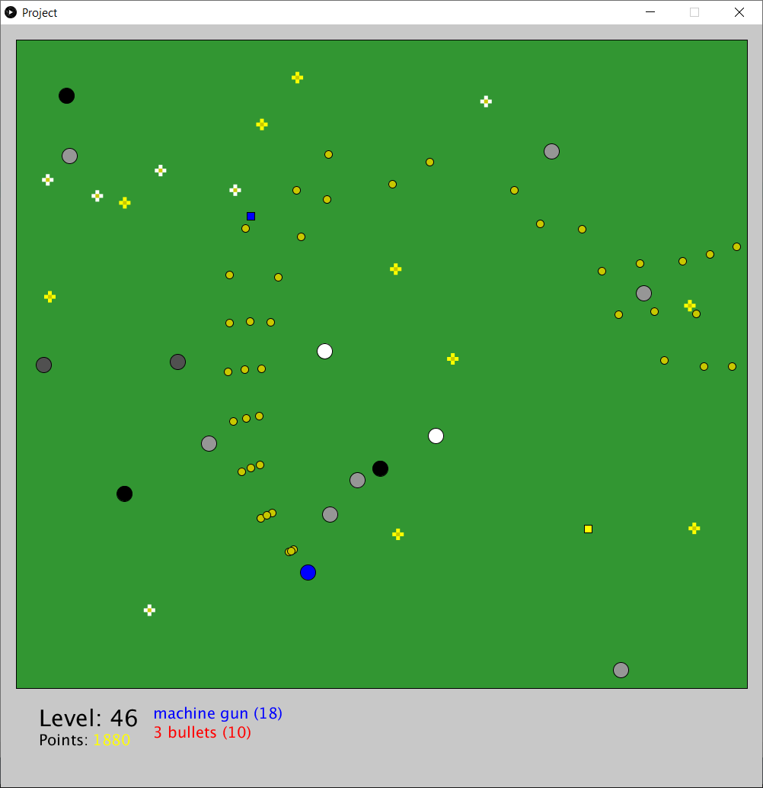

# Processing Zombie Shooting Game

A zombie shooting game developed using [Processing](https://processing.org).

This project was developed during City UoL's 2020 Coding Bootcamp.

## Bugs
* Sound starts to lag after some time.

## Sound credits
https://freesound.org/people/gneube/sounds/315844/
https://freesound.org/people/Under7dude/sounds/163439/
https://freesound.org/people/missozzy/sounds/169848/
https://freesound.org/people/FilmmakersManual/sounds/522503/
https://freesound.org/people/michorvath/sounds/427595/
https://freesound.org/people/coolguy244e/sounds/266977/